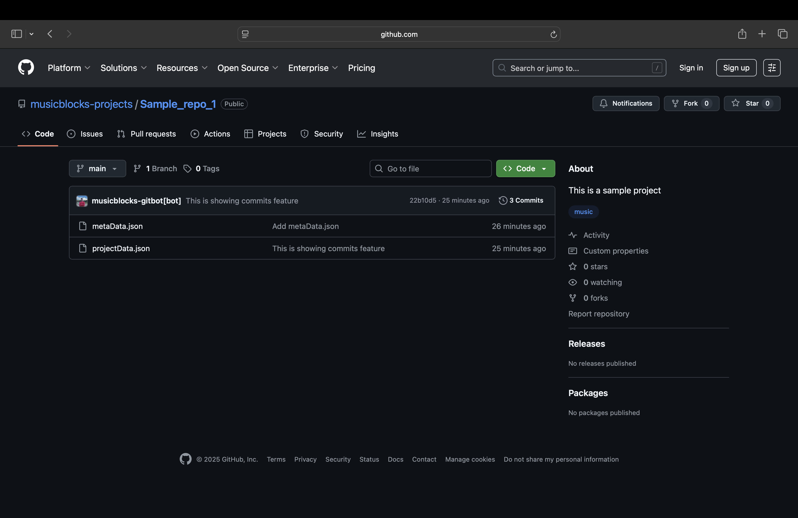
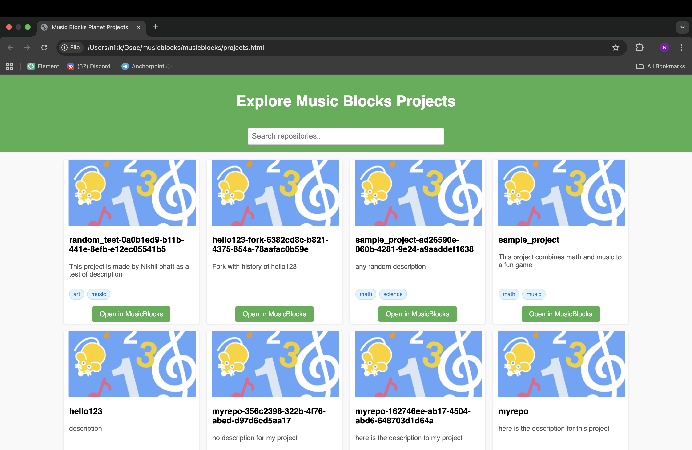
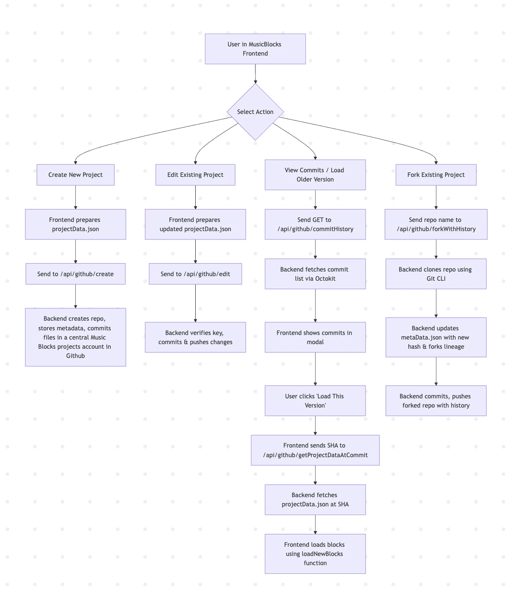

# Google Summer of Code 2025
# Sugar Labs

&nbsp;&nbsp;&nbsp;&nbsp;&nbsp;&nbsp;&nbsp;&nbsp;&nbsp;&nbsp;&nbsp;&nbsp;&nbsp;&nbsp;&nbsp;&nbsp;

## Contributor Information  

- **Name:** Nikhil Bhatt  
- **Email:** [bhattnik442@gmail.com](mailto:bhattnik442@gmail.com)  
- **GitHub:** [BeNikk](https://github.com/BeNikk)  
- **Organization:** [Sugar Labs](https://www.sugarlabs.org/)  
- **Project Repository:** [Git Backend For Music Blocks & Turtle Blocks](https://github.com/BeNikk/musicblocks-backend)  
- **Mentors:** [Walter Bender](https://github.com/walterbender), [Sumit Srivastava](https://github.com/sum2it)   
- **Project Duration:** 350 hours
---

## Description

This project introduces a Git-based backend for Music Blocks and Turtle Blocks, replacing the older Planet system for project storage. Students can now create, save, and manage their projects in a centralized Sugar Labs GitHub repository, with support for commits, edits, forks, history navigation, and downloads. By integrating Git version control, the system not only improves project management but also fosters collaboration, reflection, and portfolio creation, aligning with Sugar Labs’ educational philosophy.

## Background

At Sugar Labs, learning is deeply tied to creativity, reflection, and collaboration. Students are encouraged not only to create projects but also to think about how their work evolves over time and how they can learn from others. While students can already save and share their projects, there was an opportunity to enhance this experience by providing more structured ways to explore, manage, and interact with their work.

This project introduces a system that allows students to maintain a record of their project progress, explore different versions, collaborate with peers, and build a portfolio of their learning journey. By embedding these capabilities into Turtle Blocks and Music Blocks, students can reflect on their creative process, learn from others’ projects, and engage more deeply with their own growth, all in an intuitive, educational environment.

## Goals

The main objectives of this project were to enhance the project management and learning experience in Music Blocks and Turtle Blocks by introducing a Git-based backend. Specifically, the project aimed to:

- **Replace the Planet system:** Improve the existing project storage system to support version control and better project management.
- **Enable Project Commits and Edits:** Allow students to create, save, and update their own projects, with a record of all changes.
- **Support Forking of Projects:** Let students explore and build upon other users’ projects, fostering collaboration and peer learning.
- **Provide Project History Navigation:** Enable students to view the complete history of a project, reflecting on how it has evolved over time.
- **Allow Project Downloads:** Give students the option to download their projects for offline use or portfolio creation.
- **Integrate Seamlessly:** Ensure all features work smoothly within Music Blocks and Turtle Blocks, maintaining an intuitive educational experience.

## Demonstration

To showcase the features of the Git backend system, including global and local projects, commits, forks, and history navigation, watch the demonstration video below:

## Technical Implementation

### Phase 1: Backend Setup & Repository Creation

The initial phase focused on establishing a robust backend system to support students’ project creation, editing, and collaboration within Music Blocks and Turtle Blocks.

- **GitHub Integration:** Implemented GitHub App authentication using JWT and installation tokens, allowing secure creation of repositories within the Sugar Labs organization.
- **Repository Initialization:** Each student project is initialized with essential files (`README.md`, `projectData.json`, `metaData.json`) to store project content, metadata, and hashed keys for ownership verification.
- **Secure Project Editing:** Developed a key-based authentication system to ensure only the original student could edit their project.
- **Forking & Collaboration:** Enabled students to fork public projects, maintaining original content and metadata, fostering peer learning and exploration.
- **Pull Request Support:** Implemented backend routes for submitting updates from forked projects to the original repository, allowing maintainers to view and merge contributions efficiently.
- **Scalable Architecture:** Organized backend structure for maintainability, centralized pull request handling, and reduced frontend complexity, ensuring a smooth experience for students.

This phase laid the foundation for a student-centered system where learners can securely manage, share, and collaborate on projects while reflecting on their work and learning from peers.

### Phase 2: Frontend Integration & Enhanced Collaboration

The second phase focused on connecting the Git backend with the user interface and improving collaborative features for students.

- **Frontend-Backend Integration:** Implemented API calls to allow project creation, editing, and forking directly from the Music Blocks UI.
- **Project Dashboard:** Developed a dashboard listing all projects (original and forked) with metadata like project name, fork status, and last updated time. Students can open, edit, or fork projects seamlessly.
- **Preserving Commit History:** Enhanced fork functionality to retain full commit history using Git CLI, allowing students to trace project evolution over time.
- **Secure Forking & Metadata:** Forked projects include metadata linking back to the original repository and a new hashed key for secure ownership and editing rights.
- **Commit History & Version Travel:** Added backend routes and frontend modals for students to view and load previous commits, enabling reflective learning and exploration of project changes.
- **Pull Request Infrastructure:** Built backend routes to support submitting updates from forked projects to original repositories, preparing the system for future frontend PR integration.

This phase made the system interactive and educational, empowering students to manage, reflect on, and collaborate on their projects while exploring version control concepts in a safe and guided environment.

### Phase 3: Project Management & UX Enhancements

This phase focused on improving how students manage, describe, and organize their projects, along with enhancing the user experience for easier navigation and interaction.

- **Project Data Endpoint:** Created a backend route to fetch project data without creating a fork, allowing students to preview projects in Music Blocks before deciding to fork.
- **Custom Project Descriptions:** Enabled students to add descriptions to their projects, similar to the existing Planet page, enhancing documentation and self-reflection.
- **Fork Button in UI:** Added a "Fork This Project" button that retains full commit history and allows students to continue work on others’ projects in their own repositories.
- **Local Projects Page:** Developed a page for students to view, switch between, and edit all projects they created or forked. Local storage is used to maintain project names, keys, and descriptions for persistence.
- **Theme Feature (GitHub Topics):** Implemented repository themes such as music, education, and learning, improving project categorization and discoverability on GitHub.
- **Authenticated Repository Fetch:** Added a backend route to fetch all repositories using authenticated access, bypassing GitHub API rate limits and ensuring reliable listing of projects.
- **Updated Projects Page:** Enhanced the UI to display themes and project descriptions, making it easier for students to identify and filter projects visually.

This phase significantly enhanced project organization, usability, and visibility, allowing students to manage multiple projects efficiently while providing an intuitive interface for exploring and contributing to Music Blocks.

### Phase 4: Testing & Documentation

This phase focused on ensuring backend reliability, improving API maintainability, and creating comprehensive documentation for both backend and frontend.

- **Backend Testing with Jest:**  
  - Wrote 160+ individual tests covering core API functionality.  
  - Mocked controllers to isolate logic from external dependencies.  
  - Covered happy paths and edge cases to ensure robust API behavior.  
  - Challenges addressed included test isolation, parameter inconsistencies, and large test suite organization.

- **API Restructuring and Optimization:**  
  - Refactored route definitions for better logical grouping and maintainability.  
  - Standardized error handling and response formats.  
  - Optimized request flows to reduce unnecessary API calls.

- **Backend Documentation:**  
  - Created a detailed README with backend purpose, architecture, and tech stack (Node.js, Express, TypeScript).  
  - Documented all API endpoints, including create, edit, fork, forkHistory, createPR, openPR, commitHistory, and getProjectData.  
  - Included setup instructions, GitHub App integration, metadata structures, and security best practices.  
  - Added developer instructions for building, linting, and running tests.

- **Frontend Documentation:**  
  - Explained integration with Git-backed backend and UI workflows (initialize repo, push changes, fork, browse projects, download ZIPs).  
  - Documented frontend API contracts, localStorage usage, and legacy Planet replacement strategies.  
  - Included manual test checklists and troubleshooting tips.

- **Developer Experience Improvements:**  
  - Structured documentation with flow diagrams and examples for easy onboarding.  
  - Ensured consistency between frontend and backend documentation.  
  - Made the project setup self-contained to reduce reliance on tribal knowledge.

### Flow chart for the project architecture

## Components

The project is divided into several key components, each handling specific responsibilities to ensure a modular, maintainable, and scalable system.

### 1. Backend
- Handles all server-side logic, API endpoints, key generation and management and integration with GitHub.
- Responsible for project creation, editing, forking, commit history management, and pull request handling.
- Ensures security and access control using JWT and GitHub App authentication.
- Manages metadata, project storage, and interaction with the GitHub repositories.

### 2. Frontend
- Integrated with Music Blocks UI to provide seamless project management for students.
- Allows students to create, edit, fork, and browse projects directly from the interface.
- Displays global and local projects, project descriptions, and commit history.
- Handles local storage for quick access to user projects and project metadata.

### 3. Project Storage & GitHub Integration
- Centralized repository structure in the Sugar Labs GitHub organization.
- Initializes projects with essential files (`projectData.json`, `metaData.json`, `README.md`).
- Supports version control, commit history, fork tracking, and pull request workflows.
- Maintains metadata for secure editing and collaboration.

### 4. Testing
- Ensures reliability of backend APIs using Jest.
- Includes over 160 tests covering core functionality, edge cases, and API behavior.
- Mocks controllers to isolate logic from external dependencies.

### 5. Documentation
- Comprehensive guides for backend setup, frontend integration, API usage, and developer instructions.
- Includes flow diagrams, request/response examples, and setup instructions for contributors.
- Ensures the system is easy to understand and extend for future developers.

## Tech Stack

The project leverages modern technologies to ensure a scalable, maintainable, and educationally effective system.

### Backend
- **Language:** TypeScript  
- **Runtime:** Node.js  
- **Framework:** Express.js  
- **Git Integration:** Git CLI, GitHub REST API via Octokit  
- **Testing:** Jest  
- **Authentication:** GitHub App Authentication (JWT & installation tokens) (for the backend) 
- **Data Storage:** JSON files (`projectData.json`, `metaData.json`) for project content and metadata

### Frontend
- **Integration:** Music Blocks UI  
- **Languages:** JavaScript, HTML, CSS  
- **Local Storage:** Browser localStorage for persisting project data  
- **UI Features:** Fork button, project dashboard, commit history modals, project descriptions, theme display

## Project Timeline

| Week | Dates           | Milestones & Achievements | Blog / Report Link |
|------|----------------|---------------------------|------------------|
| Week 1 | 2025-06-01 – 2025-06-07 | Project setup, discussion with mentors, familiarization with Music Blocks and GitHub API. | [Week 1](https://www.sugarlabs.org/news/all/2025-06-08-gsoc-25-Nikhil-Bhatt-week01) |
| Week 2 | 2025-06-08 – 2025-06-14 | Initial backend setup, GitHub App authentication implemented. | [Week 2](https://www.sugarlabs.org/news/all/2025-06-10-gsoc-25-nikhilbhatt-week02) |
| Week 3 | 2025-06-15 – 2025-06-21 | Repository creation flow, project metadata structure defined. | [Week 3](https://www.sugarlabs.org/news/all/2025-06-17-gsoc-25-nikhilbhatt-week03) |
| Week 4 | 2025-06-22 – 2025-06-28 | Project commit and edit endpoints implemented, basic frontend integration started. | [Week 4](https://www.sugarlabs.org/news/all/2025-06-29-gsoc-25-nikhilbhatt-week04) |
| Week 5 | 2025-06-29 – 2025-07-05 | Forking projects implemented, secure key-based editing introduced. | [Week 5](https://www.sugarlabs.org/news/all/2025-07-06-gsoc-25-nikhilbhatt-week05) |
| Week 6 | 2025-07-06 – 2025-07-12 | Pull request backend routes prepared, improved frontend integration. | [Week 6](https://www.sugarlabs.org/news/all/2025-07-13-gsoc-25-nikhilbhatt-week06) |
| Week 7 | 2025-07-13 – 2025-07-20 | Project data endpoint added, custom project descriptions, fork button UI implemented. | [Week 7](https://www.sugarlabs.org/news/all/2025-07-20-gsoc-25-nikhilbhatt-week07) |
| Week 8 | 2025-07-21 – 2025-07-27 | Local Projects page added, multiple project management with localStorage. | [Week 8](https://www.sugarlabs.org/news/all/2025-07-27-gsoc-25-nikhilbhatt-week08) |
| Week 9 | 2025-07-28 – 2025-08-03 | GitHub topics (themes) feature added, authenticated repository fetch implemented, projects page updated. | [Week 9](https://www.sugarlabs.org/news/all/2025-08-03-gsoc-25-nikhilbhatt-week09) |
| Week 10 | 2025-08-04 – 2025-08-10 | Comprehensive backend testing with Jest, API restructuring and optimization. | [Week 10](https://www.sugarlabs.org/news/all/2025-08-10-gsoc-25-nikhilbhatt-week10) |
| Week 11 | 2025-08-11 – 2025-08-17 | Detailed backend and frontend documentation created, improved developer experience. | [Week 11](https://www.sugarlabs.org/news/all/2025-08-17-gsoc-25-nikhilbhatt-week11) |
| Week 12 | 2025-08-18 – 2025-08-24 | Feedback incorporation, final polishing. | [Week 12](#) |

## Project Resources & Code

- **Backend Code:** Complete backend implementation of the Git system for Music Blocks & Turtle Blocks.  
  [GitHub Repo](https://github.com/BeNikk/musicblocks-backend)

- **Backend README:** Detailed backend documentation including setup, API endpoints, and development instructions.  
  [Backend README](https://github.com/BeNikk/musicblocks-backend/blob/main/README.md)

- **Frontend Branch:** Frontend integration branch with Music Blocks UI connected to Git backend.  
  [Frontend Branch](https://github.com/BeNikk/musicblocks/tree/git-musicblocks-frontend)

- **Frontend README:** Documentation for frontend setup, API integration, and UI flows.  
  [Frontend README](https://github.com/BeNikk/musicblocks/blob/git-musicblocks-frontend/GITHUB_BACKEND_README.md)

- **Demo Video:** Video demonstration of the Git backend features, including commits, forks, and history navigation.  
  [Watch Demo](https://www.youtube.com/watch?v=6HJ91HYKEiQ)

## Learning & Acknowledgments

### Key Learnings

- **Version Control in Education:** Gained a deep understanding of how Git can be integrated into educational tools to enhance project management, collaboration, and reflection.
- **Backend Development:** Learned advanced backend patterns using Node.js, Express, and TypeScript, including authentication, API design, and GitHub App integration.
- **Frontend-Backend Integration:** Understood the importance of seamless communication between frontend and backend, handling API contracts, local storage management, and UI state.
- **Testing & Documentation:** Mastered writing comprehensive Jest tests for API reliability and creating detailed, developer-friendly documentation to simplify onboarding.
- **UX & Educational Perspective:** Learned how to design features that are intuitive for students while promoting learning outcomes, reflection, and collaboration.

## Future Plans

- **Educate Students on Git:** Introduce guided tutorials and interactive features within Music Blocks and Turtle Blocks to help students understand version control and Git concepts.  
- **Smooth Transition from Planet:** Fully transition existing Planet projects to the new Git backend, ensuring students retain access to their previous work.  
- **Enhanced Collaboration & Reflection:** Add features to encourage students to explore, fork, and contribute to peers' projects while reflecting on their own progress and learning journey.

### Acknowledgments

I would like to extend my heartfelt thanks to:

- **Walter Bender & Sumit Srivastava:** For their continuous mentorship, guidance, and insightful feedback throughout the project.  
- **Sugar Labs Community:** For their support, discussions, and encouragement that helped shape the project.  
- **Open Source Tools & Resources:** GitHub, Jest, and other open-source libraries that made the development process smoother and more efficient.  

Their support was invaluable in making the Git backend for Music Blocks and Turtle Blocks a successful and educational experience.
Overall, Google summer of Code 2025 was a great learning experience for me.